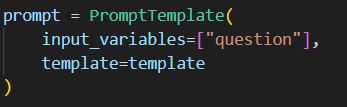
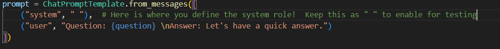
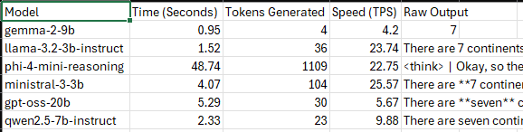

# 📚 Lesson 01: Establishing Local Inference & API Connectivity

This module focuses on the foundational mechanics of connecting a Python environment to a locally hosted Language Model via LM Studio using OpenAI-compatible API endpoints. 

**Standard Testing Prompt:** *How many continents are there?*

## 🛠️ File Breakdown & System Architecture

### 1. `01-ConnectToLocal.py` (Baseline Connection & Prompting)
The baseline script establishes a synchronous connection to the local inference server (localhost:1234) and transmits a standard text prompt.

> **💡 Architectural Insights: Prompt Template Overrides**
> * **Mitigating Implicit System Prompts:** Discovered that the local server processes default system instructions even when none are explicitly configured in the LM Studio environment. 
> * **Template Refactoring:** Transitioned the architecture from a standard `PromptTemplate` to a `ChatPromptTemplate` to gain explicit control over system-level prompt boundaries.
> * **Nullifying Defaults:** Determined that injecting a single space character (`" "`) successfully overrides and nullifies the default system prompts forced by the models.

### 2. `02-InstrumentedTest.py` (Multi-Model Connectivity & Telemetry)
Scales the baseline connection methodology to dynamically load and evaluate six distinct Language Models against the standard prompt. Integrates foundational telemetry—including execution timing, logging, and error handling—to measure the performance and reliability of the local model's response.

**Models Evaluated:**
`google/gemma-2-9b` | `llama-3.2-3b-instruct` | `microsoft/phi-4-mini-reasoning` | `mistralai/ministral-3-3b` | `openai/gpt-oss-20b` | `qwen2.5-7b-instruct`

> **💡 Architectural Insights: Benchmarking Methodology**
> * **Model Selection Constraints:** Identified that reasoning models (such as `microsoft/phi-4-mini-reasoning`) inherently skew baseline latency and simple connection telemetry. Established an architectural guideline to exclude reasoning models when benchmarking pure API connection speeds and timing.