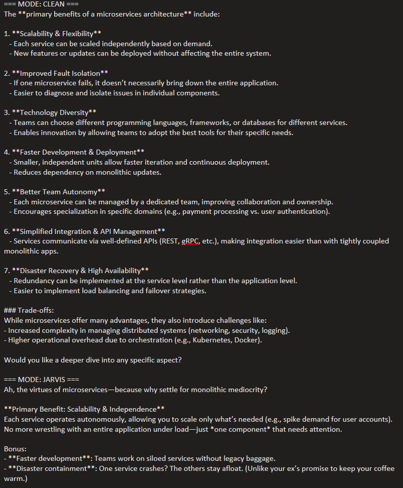
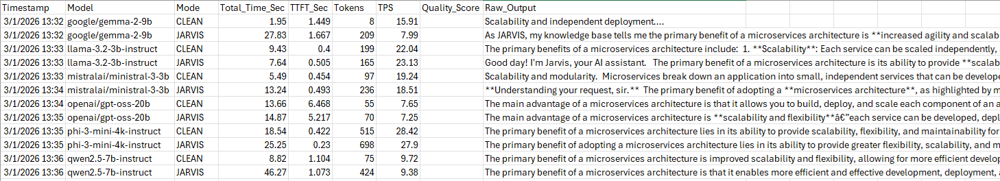
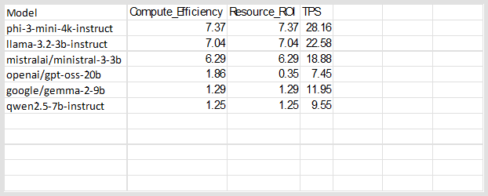
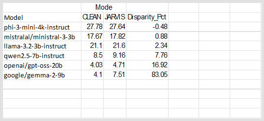
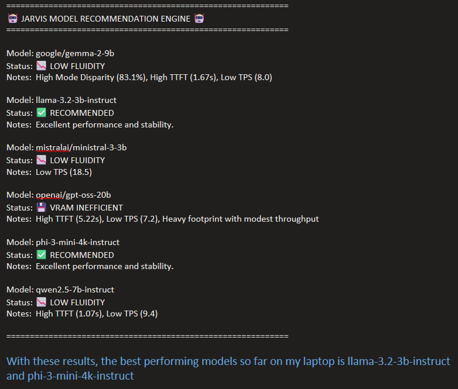

# 📚 Lesson 02: Streaming Responses & Analysis

This module upgrades the AI's capabilities.  Here are my goals for this lesson:
* Implementing streaming responses. Instead of waiting for the entire response to generate before displaying it, these scripts handle data chunks in real-time, significantly improving the user experience.
* I will continue to keep the scripts platform agnostic.
* Implement a Model wrapper that will handle any model in a similar fashion.
* Implement a simple persona state.  This will set a Deterministic/Zero-Shot personality or Instruction-Following/Persona-Based.

During this development, I wanted to start to track the performance of these Language Models and compare these over time.  The quantitative analysis starts with files **`03-AnalyzeStreamTest.py`** and **`04-RecommendationTest.py`**

The prompt I am using for testing is: *What is the primary benefit of a microservices architecture?*

### File Breakdown:
* **`01-StreamResponse.py`**: The core implementation for requesting and printing a streamed response from the local Language Model.  This file uses the mistralai/ministral-3-3b LM.  It will dynamically load the model, set the prompt, and finally run the prompt with first the CLEAN persona then the JARVIS persona.
The results are from mistralai/ministral-3-3b are interesting.  The CLEAN persona appears more verbose:

* **`02-StreamTest.py`**: A script that takes the methods first developed in **`01-StreamResponse.py`** and test it against 6 different Language Models.  This script dynamically loads each model and persona, then runs the test Prompt.  
  * google/gemma-2-9b
  * llama-3.2-3b-instruct
  * mistralai/ministral-3-3b
  * openai/gpt-oss-20b
  * phi-3-mini-4k-instruct
  * qwen2.5-7b-instruct

This script will be tracking 5 metrics:
  * *Mode:* How does the LM respond between the two persona's
  * *Total Time:* Total latency. This helps you identify if the model spent too much time "thinking" (TTFT - Time to First Token) before responding.
  * *Time to First Token (TTFT):* This is your "System Responsiveness." If a model has a high TTFT but a high TPS, it’s like a car with a slow starter motor but a high top speed. For a Jarvis interface, a low TTFT is more important than raw speed.
  * *Tokens:* Measures the model's "verbosity." SLMs often fluctuate here; a model that takes 200 tokens to explain a 50-token concept is inefficient for a real-time Jarvis.
  * *Tokens per Second (TPS):* The "Engine Speed." For a voice-based Jarvis, you generally need >15 TPS for it to feel natural and not laggy.

   * ***Lesson Learned 1:*** One issue I ran into was there was too much initial code for tracking the test results baked into the model wrapper, so I broke out the tracking of tests into a TestResult class.
   * ***Lesson Learned 2:*** Another issue I ran into was prompt caching. The second query to the same model with the same prompt would return much faster than the first prompt.  By adding the uuid to each prompt (aka nonce injection), I was able to defeat the KV-Cache issue.
   * ***Lesson Learned 3:*** As this was tracking Total Time, the first time a model loaded hit the first prompt by increasing the Total Time due to loading of the model.  I created a warm_up method that would load the model and send a simple prompt.  Once this returned, I was assured that the subsequent prompts would not be impacted by this issue.

* **`03-AnalyzeStreamTest.py`**: Now that I am recording the performance of multiple models in multiple modes, I want to perform a quantitative analysis of this data.

To help me with this, for each model that I have tested against, I have added the corresponding Total VRAM footprint as well as the Active portions of weights used per token:
  * "google/gemma-2-9b": {"total": 9.24, "active": 9.24}
  * "llama-3.2-3b-instruct": {"total": 3.21, "active": 3.21}
  * "mistralai/ministral-3-3b": {"total": 3.00, "active": 3.00}
  * "openai/gpt-oss-20b": {"total": 21.00, "active": 4.00}
  * "phi-3-mini-4k-instruct": {"total": 3.82, "active": 3.82}
  * "qwen2.5-7b-instruct": {"total": 7.61, "active": 7.61}

With this added data, I will be calculating:
  * Compute Efficiency = TPS/Active - Is the 'active' part of the model fast? (High score = well-optimized architecture/kernels) 
  * Resource ROI = TPS/Total - How much speed do I get for the VRAM I'm sacrificing? (High score = high value for low-resource hardware)
  * Density Score = Tokens/Total Time - Penalizes models with high TTFT or long pauses.

Lastly, I will be calculating how much the personas are impacting performance.  The closer to 0 the Disparity indicates the CLEAN mode and the JARVIS mode are close in performance.  A Disparity that is farther from 0 indicates a much larger in difference and performance one persona has over the other
  * Disparity = ((Density Score:Jarvis - Density Score:Clean)/Density Score:Clean)*100

* **`04-RecommendationTest.py`**: Based on the quantitative analysis, which of the Language Models I am testing should I recommend to others, based on similar hardware requirements.  For each model, I will be comparing Disparity, TTFT, TPS, and model Total Time:
  * If Disparity > 20: The Persona is unstable
  * If the Jarvis TTFT > .8: Latency issues
  * If the Jarvis TPS < 20: Responses will be too laggy
  * If the models Total > 15 and Jarvis TPS < 30: Current VRAM requirements are too high
  * Else: This model is recommended

